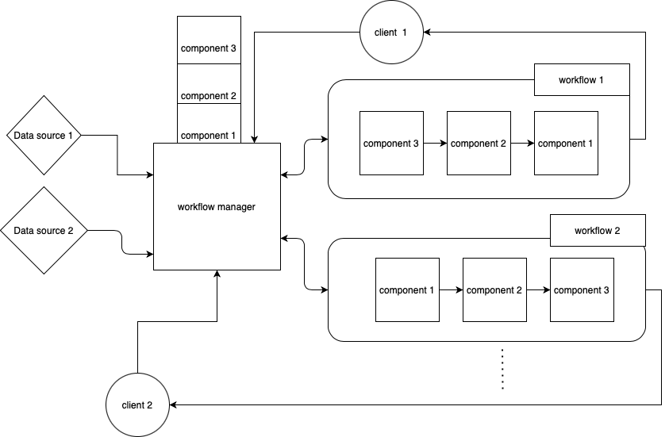

### Workflow generator

Cloud computing provides on-demand computing resources, network and infrastructure resources, Services and Application platforms over the Internet. Edge computing is an enhancement on the top of existing cloud infrastructure to facilitate local edge node-based distributed computing environment, hence data can be stored and processed, and analyzed locally to deliver faster results. The combination of these two technologies provides a better performance on IoT applications. This project implements a workflow generating system lets users launches random combination of pre-exisiting components. Also compares performance of shared and non-sharing component(container) among workflows. 

### Conclusion
In conclusion, reuse and no reuse case has similar cold start time but the noreuse case had a higher overhead for the second and above workflow. On the response time perspective noreuse case has smaller response time due to the container only processing requests from one workflow. Both reuse and no-reuse methods have similar loading on hardware and network utilization. The reuse case has slightly higher memory usage because the requesting routing data is being stored in memory.  

The detailed report is in report.pdf.